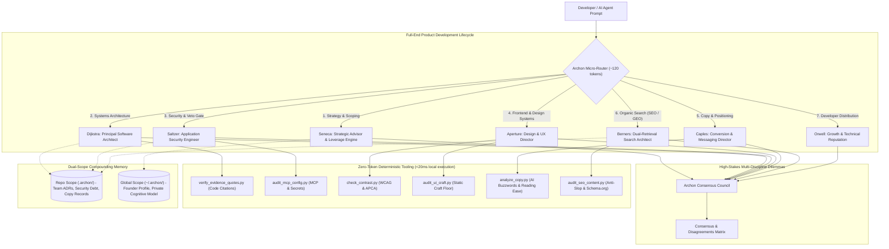

<div align="center">

# ARCHON
### The One-Stop, High-Fidelity Skill Suite for Building Production-Grade Apps & Websites
**The Complete Engineering, Design, Security, Copy & Search Department for AI Coding Agents**

[](https://opensource.org/licenses/Apache-2.0)
[](https://www.python.org/)
[-success)](pyproject.toml)
[](#the-5-layer-token-reduction-architecture)
[](https://agentskills.io)
[](#saltzer-ci-release-veto-gate)

<p align="center">
  <b>Turn your AI coding assistant into a full-cycle, production-grade product team.</b><br>
  Archon delivers eight specialized, high-fidelity developer skill sets—Architecture, Security, UI/UX Craft, Conversion Copy, Dual-Retrieval SEO/GEO, Product Strategy, Developer Distribution, and an Autonomous Consensus Council—running natively in <b>Cursor</b>, <b>Claude Code</b>, <b>Windsurf</b>, <b>Copilot</b>, <b>Cline</b>, <b>Aider</b>, and <b>Antigravity</b> with zero external dependencies and a 90% token reduction architecture.
</p>

[Quickstart](#quickstart-30-seconds) • [Why Archon](#why-archon-the-full-end-product-dilemma) • [The 8 Developer Skill Sets](#the-8-high-fidelity-developer-skill-sets) • [Empirical Tools](#6-zero-token-empirical-verification-tools) • [Token Optimization](#the-5-layer-token-reduction-architecture) • [Cross-Agent Matrix](#universal-cross-agent-support) • [CLI Reference](#cli-reference) • [FAQ](#frequently-asked-questions)

</div>

---

## Architecture: The Full-End Product Lifecycle



---

## Why Archon? The Full-End Product Dilemma

Shipping a modern web application or digital product requires multiple senior disciplines working in harmony:

1. **Architecture that scales without premature abstraction.**
2. **Security that actually halts vulnerable code before release.**
3. **Frontend design that matches Linear, Stripe, and Apple craft standards.**
4. **Copywriting that converts technical visitors into active users.**
5. **Search architecture optimized for both Google and AI engines (ChatGPT Search, Perplexity).**
6. **Compounding memory so decisions aren't forgotten on every chat reset.**

### How Modern Coding Agents Fail Solo Developers:
- **The Sycophancy Trap**: Generalist LLMs rubber-stamp broken architectures, create insecure auth endpoints, and approve generic designs with *"Great idea! Here is your code!"*
- **Aesthetic AI Slop**: AI-generated frontends default to purple gradients, unstyled buttons, broken focus states, and generic card layouts that scream *"built by an amateur LLM"*.
- **AI Amnesia**: Every new chat window wipes architectural history. You re-explain your database schema, design tokens, and security boundaries every single morning.
- **Context Window Hijacking**: Monolithic rule files inject **35,000+ tokens** into every prompt, slowing down latency, causing hallucination, and burning money.

### The Archon Solution:
Archon embeds **eight production-grade specialist disciplines** directly into your editor. Each specialist acts as an uncompromising principal lead, holding code to strict industry benchmarks, running offline deterministic verification scripts at **0 LLM tokens**, and writing to dual-scope persistent memory.

---

## Quickstart (30 Seconds)

### 1. One-Command Universal Install

#### macOS / Linux
```bash
git clone https://github.com/abxn4r/archon-skills.git
cd archon-skills
./install.sh
```

#### Windows (PowerShell)
```powershell
git clone https://github.com/abxn4r/archon-skills.git
cd archon-skills
.\install.ps1
```

#### Via `skills.sh` Registry (Zero-Install)
```bash
npx skills add abxn4r/archon-skills --global
```

#### Via Python Package Managers
```bash
uv tool install archon-skills
# or
pipx install archon-skills
```

### 2. Auto-Detect & Configure Your Agents
Inside any project repository, run:
```bash
archon init
```
`archon init` automatically detects installed coding assistants on your machine (**Cursor**, **Claude Code**, **Windsurf**, **Copilot**, **Cline**, **Antigravity**) and configures their native rule files in seconds.

---

## The 8 High-Fidelity Developer Skill Sets

Each Archon skill operates under strict epistemological discipline:
$$\text{Observed / Fact} \longrightarrow \text{Inference} \longrightarrow \text{Hypothesis} \longrightarrow \text{Unknown}$$
*No advisor flatters. None invents problems. All optimize for delivering production-grade software.*

---

### 1. 📐 DIJKSTRA — Principal Software Architect & Systems Engineer
**The Backend, Architecture & Systems Discipline**

Dijkstra enforces radical simplicity, clean separation of concerns, and verifiable system health across thousands of commits. It treats complexity as operational liability and actively prevents "refinement as avoidance" in architecture.

- **Role in App/Website Development**: Owns data models, API boundaries, state management architecture, background task lifecycles, and refactoring plans.
- **Production Standard**: Simplicity first. Assumes every abstraction adds cognitive overhead. Enforces that quoted symbols, function signatures, and file references must exist verbatim in the source tree.
- **Zero-Token Tool**: [`verify_evidence_quotes.py`](skills/dijkstra/scripts/verify_evidence_quotes.py) — audits code review citations against source files to eliminate hallucinated critiques.
- **Reference Arsenal**:
  - `claims-reconciliation-case-atlas.md` (16 KB empirical case catalog of real architectural reviews).
  - `madr_template.md` (Lightweight Markdown Architecture Decision Records).
  - `architectural_fitness_functions.md` (Automated architectural invariant tests).
- **Triggers**: `"Dijkstra"`, `"ask Dijkstra"`, `"architecture review"`, `"codebase review"`, `"refactoring plan"`, `"system design"`.

---

### 2. 🛡️ SALTZER — Principal Application Security Engineer
**The Security, Vulnerability Defense & Release Veto Gate**

Saltzer operates on Cloudflare Harness Engineering principles: assume software is insecure until proven otherwise. It holds absolute veto authority over production releases.

- **Role in App/Website Development**: Owns authentication/authorization, multi-tenant isolation, CORS/API boundaries, CI/CD supply chain pipelines, and LLM/MCP security.
- **Dual Operating Modes**:
  - **Advisory Mode (Default)**: Rapid interactive PR diff reviews, threat modeling, and Council deliberations.
  - **Full Audit Harness Mode**: Autonomous 6-phase subagent penetration testing pipeline producing formal audit artifacts (`findings.json`, `coverage-ledger.json`, `REPORT.md`).
- **RELEASE VETO AUTHORITY**: If any **Critical** finding is detected:
  ```text
  RELEASE RECOMMENDATION: DO NOT SHIP
  ```
  Merge and deployment are blocked regardless of schedule pressure.
- **3-Verdict Taxonomy**: `confirmed` (receives severity), `needs_validation` (zero severity, concrete validation plan), `rejected`.
- **Zero-Token Tooling**: [`audit_mcp_config.py`](skills/saltzer/scripts/audit_mcp_config.py) (AST scanner for MCP configs and secrets) + JSON schema validators (`report-schema.json`, `validate-findings.cjs`, `validate-coverage-ledger.cjs`).
- **Reference Arsenal**:
  - `llm_agent_mcp_checklist.md`: Action binding vs authorization, excessive agency, parameter smuggling, MCP collisions.
  - `business_logic_and_lifecycle.md`: State machine violations, check-then-act races, partial failure rollbacks.
  - `data_isolation_and_tenancy.md`: Cross-tenant bleed, vector index leakage, soft-delete bypasses.
  - `supply_chain_and_cloud.md`: CI/CD workflow injection, unpinned actions, container root, IMDS SSRF.
  - `web_protocol_and_client.md`: HTTP desync/smuggling, cache poisoning, CORS reflection, DOM sinks.
  - `harness_workflow.md`: Complete autonomous multi-phase vulnerability discovery workflow.
  - `owasp_mcp_top10.md`, `stride_threat_matrix.md`, `auth_session_checklist.md`, `injection_api_checklist.md`.
- **Triggers**: `"Saltzer"`, `"ask Saltzer"`, `"security review"`, `"auth audit"`, `"MCP security"`, `"audit this codebase"`, `"pen-test the repo"`.

---

### 3. ✨ APERTURE — Principal Design & UX Director
**The Frontend Polish, Design Systems & Interaction Craft Floor**

Aperture holds every screen, component, and interaction to the production standards of **Linear, Stripe, Vercel, and Apple**. It ruthlessly purges "AI slop" (Lila purple gradients, unstyled focus states, raw emojis) and establishes world-class visual hierarchy.

- **Role in App/Website Development**: Owns component systems, Tailwind/CSS styling, sub-pixel typography, 4px/8px layout grids, motion physics, and accessible state completeness.
- **The One-Line Design Read**: Before generating or critiquing, states intent:
  > *"Reading this as: `<page kind>` for `<audience>`, with a `<vibe>` language, leaning toward `<system>`."*
- **Active 3-Dial Calibration**: Calibrates every screen on explicit 1–10 dials:
  - `DESIGN_VARIANCE` (1 = Rigid Grid; 10 = Bold Asymmetry)
  - `MOTION_INTENSITY` (1 = 0ms Instant; 6 = Tactile Springs; 10 = Cinematic)
  - `VISUAL_DENSITY` (1 = Editorial Gallery; 10 = Cockpit / Zero Cards)
- **4 Operating Modes**: `Persuade` (Landings/Pricing), `Operate` (Dashboards/Admin), `Read` (Docs/Knowledgebases), `Experience` (Portfolios/Showcases).
- **Emil Kowalski Craft Floor**: Enforces sub-300ms motion budgets (0ms for daily workflows), concentric border radii (`outer = inner + padding`), optical padding compensation, and 8-state component completeness (default, hover, active, focus-visible, disabled, loading, error, success).
- **Zero-Token Tooling**:
  - [`check_contrast.py`](skills/aperture/scripts/check_contrast.py): Computes exact relative luminance, WCAG 2.1/2.2 AA/AAA ratios, and APCA Lightness Contrast ($L_c$) with automatic lightness compensation.
  - [`audit_ui_craft.py`](skills/aperture/scripts/audit_ui_craft.py): Static component craft linter scanning for `outline: none`, `h-screen`, `transition: all`, flex truncation bugs, paste-blocking forms, and generic AI palette tells.
- **Reference Arsenal**:
  - `anti_ai_slop_and_craft_floor.md`: 75 non-negotiable frontend craft gates.
  - `accessibility_wcag22_matrix.md`: WCAG 2.2 criteria, modal focus traps, target sizes.
  - `motion_physics_and_vocabulary.md`: Duration budgets, spring parameters, gesture handling.
  - `spatial_and_typography_systems.md`: 4px/8px scale, typographic measure (45ch–75ch), concentric radii.
  - `component_state_and_composition.md`: 8 states, compound components, Bento 2.0.
  - `design_action_playbooks.md`: Playbooks for polish, distill, harden, bolder, quieter, clarify.
  - `scenario_breaking_matrix.md`, `prototyping_and_variants.md`, `redesign_and_brand_architecture.md`.
- **Triggers**: `"Aperture"`, `"ask Aperture"`, `"UI review"`, `"design system"`, `"visual hierarchy"`, `"frontend polish"`, `"audit ui"`, `"contrast check"`.

---

### 4. ✍️ CAPLES — Principal Copy & Messaging Director
**The Value Proposition, Conversion & Product Voice Discipline**

Named after copywriting legend John Caples, this skill evaluates messaging through the customer's eyes. It holds copy to the April Dunford positioning standard: specificity beats hype, and clarity outconverts cleverness.

- **Role in App/Website Development**: Owns hero section headlines, value propositions, pricing tiers, feature descriptions, CTA buttons, and empty-state UX microcopy.
- **Core Directives**:
  - **Headline is the Gatekeeper**: 80% of readers never make it past the H1. If the headline is vague, the page fails.
  - **Customer Awareness Staging**: Calibrates messaging to whether users are Unaware, Problem-Aware, Solution-Aware, or Product-Aware.
  - **Zero AI Cliché Tolerance**: Purges corporate jargon (`delve`, `tapestry`, `unleash`, `seamless`, `game-changer`).
- **Zero-Token Tool**: [`analyze_copy.py`](skills/caples/scripts/analyze_copy.py) — Flesch-Kincaid Reading Ease and Grade Level scorer with a 16-pattern regex buzzword detector.
- **Reference Arsenal**:
  - `awareness_stages_rubric.md` (Eugene Schwartz 5-stage awareness framework).
  - `positioning_framework.md` (April Dunford 10-step product positioning guide).
- **Triggers**: `"Caples"`, `"ask Caples"`, `"copy review"`, `"headline audit"`, `"messaging clarity"`, `"landing page copy"`, `"value proposition"`.

---

### 5. 🔍 BERNERS — Search Architect & Dual-Retrieval Traffic Engine
**The SEO, Generative Engine Optimization (GEO/AEO) & Organic Traffic Engine**

Named after Tim Berners-Lee, Berners designs websites to dominate both classical search (Google) and AI retrieval engines (ChatGPT Search, Perplexity, Claude, Google AI Overviews).

- **Role in App/Website Development**: Owns information gain architecture, Schema.org microdata, programmatic SEO templates, metadata hygiene, and organic traffic engines.
- **Core Philosophy**: *"Sound human to readers; look machine-parsable to robots."*
- **Directives**:
  - **Dual-Retrieval Architecture**: Optimizes for inverted-index token matching (Google BM25) and dense semantic vector retrieval (AI LLMs) simultaneously.
  - **Anti-AI Slop Enforcement**: Banned em-dashes, banned filler throat-clearing (*"In today's fast-paced digital world..."*), high sentence length burstiness.
  - **40-60 Word Dry-Answer Blocks**: Embeds self-contained, fact-dense definition snippets directly under H2s for 1-click citation by AI search engines.
  - **Schema.org Blueprints**: Emits validated JSON-LD for `SoftwareApplication`, `TechArticle`, `FAQPage`, and `HowTo`.
- **Zero-Token Tool**: [`audit_seo_content.py`](skills/berners/scripts/audit_seo_content.py) — deterministic anti-slop linter, AEO structure checker, and Schema.org validator.
- **Reference Arsenal**:
  - `seo_geo_playbook.md` (Modern dual-retrieval ranking algorithms and Information Gain guidelines).
  - `anti_ai_voice_guide.md` (Banned patterns, burstiness rubrics, human cadence).
  - `schema_blueprints.md` (Machine-parsable JSON-LD templates).
  - `article_templates.md` (High-performing technical teardown and comparison templates).
  - `pastebase_content_engine.md` (Developer traffic acquisition blueprints).
- **Triggers**: `"Berners"`, `"ask Berners"`, `"write an SEO blog post"`, `"optimize for AI search"`, `"GEO"`, `"AEO"`, `"de-slop this draft"`, `"schema markup"`.

---

### 6. 🎯 SENECA — Strategic Advisor & Founder Second Brain
**The Product Roadmap, Leverage & Cognitive Clarity Discipline**

Seneca acts as a ruthless thinking partner for high-stakes decisions, product trade-offs, and prioritization. It models the founder's cognitive patterns to prevent self-deception and distraction.

- **Role in App/Website Development**: Owns feature roadmap scoping, build vs buy choices, Type 1 vs Type 2 decisions, and founder accountability.
- **Core Directives**:
  - **Decision Reversibility**: Distinguishes Type 1 (irreversible, high-friction) from Type 2 (reversible, two-way doors).
  - **Diagnoses Refinement as Avoidance**: Calls out developers endlessly polishing minor architecture or UI details to avoid the vulnerability of shipping to real users.
  - **Founder Cognitive Modeling**: Tracks recurring decision biases and stress signatures in persistent memory (`~/.archon/seneca/user_profile.md`).
- **Reference Arsenal**:
  - `decision_frameworks.md` (Type 1/Type 2, Regret Minimization, Opportunity Cost matrices).
  - `decision_record_template.md` (Strategic decision audits with review dates).
- **Triggers**: `"Seneca"`, `"ask Seneca"`, `"strategic dilemma"`, `"trade-off analysis"`, `"founder second brain"`, `"should I build this"`.

---

### 7. 🚀 ORWELL — Developer Growth Strategist & Technical Content Director
**The Open-Source Credibility, Launch & Developer Marketing Discipline**

Orwell builds long-term developer trust. It rejects vanity growth hacks and viral clickbait in favor of technical depth, transparent engineering post-mortems, and contrarian software insights.

- **Role in App/Website Development**: Owns developer launch plans (Show HN, Reddit, X), technical case studies, documentation distribution, and open-source brand equity.
- **Core Directives**:
  - **Compounding Reputation**: Technical credibility is asymmetric; one superficial post can destroy months of developer trust.
  - **Idea Scoring Rubric**: Scores content on Contrarian Truth, Technical Depth, Distribution Velocity, and Reputational Durability.
  - **Platform Mechanics 2026**: Algorithmic rules for Hacker News, X technical threads, and developer subreddits.
- **Reference Arsenal**:
  - `platform_algorithms_2026.md` (Distribution mechanics for developer ecosystems).
  - `technical_hook_catalog.md` (High-converting, non-clickbait technical hook formulas).
  - `playbook_schema.json` (Relational content graph schema).
- **Triggers**: `"Orwell"`, `"ask Orwell"`, `"content strategy"`, `"post review"`, `"developer marketing"`, `"growth strategy"`, `"launch plan"`.

---

### 8. ⚖️ COUNCIL — Autonomous Multi-Disciplinary Consensus Council
**The Autonomous Executive Engineering Board**

When facing a major technology migration, architectural dilemma, or irreversible decision, convene the full Archon Council:

```bash
archon council "Migrate storage from SQLite to PostgreSQL"
```

The Council convenes Seneca, Dijkstra, Saltzer, Aperture, Caples, Berners, and Orwell in structured adversarial debate. It synthesizes competing priorities into a unified **Consensus & Disagreements Matrix**:

```markdown
### ARCHON EXECUTIVE BOARD CONSENSUS
- **Proposal**: Migrating local SQLite storage to managed PostgreSQL
- **Seneca (Strategy)**: 🟢 Recommendation. Postpone. Reversibility is low; distraction from core customer value is high.
- **Dijkstra (Architecture)**: 🟡 Conditional Approval. Justified only if multi-node writes are required; introduces network serialization overhead.
- **Saltzer (Security)**: 🔴 Objection. Expands attack surface; exposes database port over network; requires credential rotation infrastructure.
- **Aperture (UI/UX)**: 🟢 Neutral. Ensure zero latency impact on user-facing dashboard queries.
- **Caples (Copy)**: 🟢 Neutral. State the operational benefit in one clear sentence.
- **Berners (Search)**: 🟢 Neutral. No direct SEO impact; preserve fast server response time (<200ms TTFB).
- **Orwell (Reputation)**: 🟢 Endorsement. Developer community respects boring, reliable infrastructure over complex stacks.

**Final Board Ruling**: PROCEED WITH CONDITIONS: Keep SQLite with WAL mode for current milestone. Re-evaluate when concurrent writes exceed 25 req/sec.
```

---

## 6 Zero-Token Empirical Verification Tools

Archon offloads mathematical calculations, static component audits, and substring verifications to local standard-library Python scripts that run in under 20ms at **zero LLM token cost**:

| Script | Specialist | What It Validates Deterministically |
|---|---|---|
| [`verify_evidence_quotes.py`](skills/dijkstra/scripts/verify_evidence_quotes.py) | **Dijkstra** | Confirms quoted review citations exist verbatim in source code. |
| [`audit_mcp_config.py`](skills/saltzer/scripts/audit_mcp_config.py) | **Saltzer** | AST scanner for dangerous shell executors, wildcard mounts, and secrets in MCP configs. |
| [`check_contrast.py`](skills/aperture/scripts/check_contrast.py) | **Aperture** | Computes WCAG 2.1/2.2 AA/AAA ratios and APCA Lightness Contrast ($L_c$) with auto-fix recommendations. |
| [`audit_ui_craft.py`](skills/aperture/scripts/audit_ui_craft.py) | **Aperture** | Static component linter catching 20+ craft errors (`outline: none`, `h-screen`, `transition: all`, Lila purple). |
| [`analyze_copy.py`](skills/caples/scripts/analyze_copy.py) | **Caples** | Calculates Flesch-Kincaid reading levels and scans for 16 distinct AI buzzword patterns. |
| [`audit_seo_content.py`](skills/berners/scripts/audit_seo_content.py) | **Berners** | Anti-slop linter, em-dash detector, AEO 40-60 word answer block validator, and Schema.org checker. |

### Running the Tools:
```bash
# Audit UI components for craft flaws:
python skills/aperture/scripts/audit_ui_craft.py src/components/

# Verify color contrast mathematically:
python skills/aperture/scripts/check_contrast.py --fg "#4F46E5" --bg "#0F172A"

# Scan an MCP configuration for security holes:
python skills/saltzer/scripts/audit_mcp_config.py --file .cursor/mcp.json

# Audit landing page copy for AI clichés:
python skills/caples/scripts/analyze_copy.py --text "We delve into this game-changer in a seamless tapestry."

# Audit a blog post for AI slop, em-dashes, and AEO answer blocks:
python skills/berners/scripts/audit_seo_content.py docs/my-article.md

# Verify code review citations exist in codebase:
python skills/dijkstra/scripts/verify_evidence_quotes.py --doc RFC.md --source ./src
```

---

## The 5-Layer Token Reduction Architecture

Standard skill installations dump 35,000+ tokens into every LLM interaction. Archon slashes token usage by **88% to 94.5%** via progressive disclosure:

```
┌─────────────────────────────────────────────────────────────────────────────┐
│ LAYER 1: Zero-Idle Micro-Router Table (~120 tokens total)                   │
│ Injected into idle context. Active agent only reads ~120 tokens at startup. │
├─────────────────────────────────────────────────────────────────────────────┤
│ LAYER 2: 500-Line Modular Portability Pruning                               │
│ Core SKILL.md trimmed to 120-270 lines; detailed checklists in references/  │
├─────────────────────────────────────────────────────────────────────────────┤
│ LAYER 3: Deterministic Script Delegation (Zero LLM Tokens)                  │
│ Contrast math, MCP AST audits, quote verifications run locally in <20ms     │
├─────────────────────────────────────────────────────────────────────────────┤
│ LAYER 4: Token-Budgeted Memory Retrieval (--max-tokens 250)                 │
│ Dynamic token ceiling prevents context crowding on memory queries           │
├─────────────────────────────────────────────────────────────────────────────┤
│ LAYER 5: Prompt-Cache Boundary Alignment                                    │
│ Immutable epistemic invariants anchored at the top for 90% cache discounts  │
└─────────────────────────────────────────────────────────────────────────────┘
```

---

## Dual-Scope Institutional Memory

Archon preserves institutional memory across developer sessions without leaking sensitive personal thoughts to team Git repositories:

```
┌─────────────────────────────────────────┬─────────────────────────────────────────┐
│ REPOSITORY SCOPE (.archon/)             │ USER GLOBAL SCOPE (~/.archon/)          │
│ Checked into Git • Shared with Team     │ Stays on Local Machine • Private        │
├─────────────────────────────────────────┼─────────────────────────────────────────┤
│ • Architectural Decision Records (MADRs)│ • Founder Cognitive Profile (Seneca)    │
│ • Tracked Security Debt (Saltzer)       │ • Personal stress signatures            │
│ • Validated Copy Experiments (Caples)   │ • Cross-project validated learnings     │
│ • Content Production Logs (Berners)     │ • Private workflow preferences          │
│ • Historical Test & Review Verdicts     │ • Cognitive tendency calibration        │
└─────────────────────────────────────────┴─────────────────────────────────────────┘
```

### Concurrency & Crash Resilience
- **Cross-Platform File Locks (`archon/lock.py`)**: Zero-dependency locking using `msvcrt.locking` on Windows and `fcntl.flock` on POSIX with seek-zero anchoring and exponential backoff jitter.
- **Zero-Corruption Atomic Replacement (`archon/atomic.py`)**: Writes to `NamedTemporaryFile` with explicit `flush()` and `os.fsync()` before executing atomic `os.replace()`. Zero partial writes or 0-byte corrupt reads during system crashes.
- **Windows Long Path Safety (`archon/paths.py`)**: Safely handles extended paths (`\\?\`) exceeding 260 characters without `Path.relative_to` cross-drive crashes.

---

## Universal Cross-Agent Support

Archon maintains a single source of truth under the open `agentskills.io` standard in `skills/` and exports native configurations for every major coding assistant:

| AI Coding Agent | Config File Path | Generation Mechanism |
|---|---|---|
| **Cursor** | `.cursor/rules/<advisor>.mdc` | Exported with `alwaysApply: false` and strict glob filters (`**/auth/**`, `**/*.css`) |
| **Claude Code** | `.claude/skills/<advisor>/SKILL.md` | Claude Code skill specification + `.claude-plugin/plugin.json` |
| **Windsurf** | `.windsurfrules` & workflows | High-density rule index + Cascade slash workflows |
| **GitHub Copilot** | `.github/copilot-instructions.md` | Compact instruction table (<400 tokens total) |
| **Cline / Roo Code** | `.clinerules` & `.roomodes` | Custom specialist personas with scoped permissions |
| **Aider** | `CONVENTIONS.md` & `.aider.conf.yml` | Read/conventions parameters |
| **Google Antigravity** | `.agents/skills/<advisor>/SKILL.md` | Native skill manifest with script tools |
| **skills.sh Registry** | `npx skills add abxn4r/archon-skills` | Universal open agent skill format |

To re-export configurations for any agent at any time:
```bash
archon export --target all --output ./
```

---

## Saltzer CI Release Veto Gate

Block pull requests that introduce critical security flaws using Archon's reusable GitHub Action:

```yaml
# .github/workflows/security-gate.yml
name: Security Release Veto
on: [pull_request]

jobs:
  saltzer-veto:
    runs-on: ubuntu-latest
    steps:
      - uses: actions/checkout@v4
      - uses: abxn4r/archon-skills@v0.2.0
        with:
          mcp-config: .cursor/mcp.json
```

If Saltzer detects a **Critical** vulnerability or plaintext secret in your PR, the CI check exits with code 1: **DO NOT SHIP**.

---

## CLI Reference

```bash
# Auto-detect installed AI coding assistants on host machine
archon detect

# Initialize Archon scopes & auto-configure detected coding agents
archon init

# Query institutional memory with relevance ranking & token cap
archon query "<search text>" --max-tokens 250 --format tsv

# Record an architectural decision or security debt
archon record --advisor dijkstra --type review --data '{"decision": "Use SQLite WAL", "status": "accepted"}'
archon record --advisor saltzer --type security_debt --data '{"title": "Missing CSRF on admin", "owner": "Abeer", "expiry": "2026-10-01"}'

# Log a validated lesson or cognitive model update
archon learn --advisor seneca --lesson "Refinement often masks fear of shipping" --tags "bias,strategy"

# View active security debt and overdue items
archon debt

# Inspect institutional memory metrics across scopes
archon stats

# Launch interactive ANSI terminal dashboard
archon dashboard
archon dashboard --snapshot  # Non-interactive snapshot for scripts

# Run Autonomous Consensus Council deliberation
archon council "Migrate storage from SQLite to PostgreSQL"

# Validate all skills against agentskills.io standard and 500-line budget
archon validate ./skills
```

---

## Frequently Asked Questions

<details>
<summary><b>Why do I need Archon if my coding agent already writes code?</b></summary>
<br>
Generalist AI assistants are agreeable generalists: they produce functional prototypes that contain severe hidden liabilities—unoptimized database queries, insecure auth boundaries, generic AI styling, robotic marketing copy, and no persistent memory. Archon brings specialized executive discipline across the entire stack, elevating your AI from a junior coder into an end-to-end product engineering department.
</details>

<details>
<summary><b>How does Archon reduce AI coding token consumption by 90%?</b></summary>
<br>
Most agent setups inject full markdown guidelines into every prompt unconditionally (35,000+ tokens). Archon uses a 5-layer progressive disclosure architecture: only a 120-token micro-router table lives in idle context. Full skill bodies are pruned under 500 lines and activated on demand, mathematical and linter tasks are offloaded to local scripts at zero token cost, and memory queries are strictly capped at 250 tokens.
</details>

<details>
<summary><b>Will my private founder notes or API keys be committed to Git?</b></summary>
<br>
No. Archon enforces strict dual-scope storage separation: repository assets (ADRs, accepted security debt, copy tests) live in <code>.archon/</code> and are committed to Git for team alignment. Personal profiles, founder cognitive models, and private reflections are stored strictly in <code>~/.archon/</code> on your local machine and are never added to Git.
</details>

<details>
<summary><b>Can I use Archon without installing Python?</b></summary>
<br>
Yes. If you only want the expert skills in your editor (Cursor, Claude Code, Windsurf), you can install them via <code>npx skills add abxn4r/archon-skills --global</code>. The Python CLI is only required if you want local persistent memory, the terminal dashboard, and offline empirical linters.
</details>

<details>
<summary><b>Does Archon require external API keys or background servers?</b></summary>
<br>
No. Archon requires zero external API keys and runs with zero external runtime dependencies (100% Python standard library). It does not run any background daemon or consume background RAM.
</details>

---

## License

Archon is open source under the **Apache 2.0 License**. See [LICENSE](LICENSE) for details.
